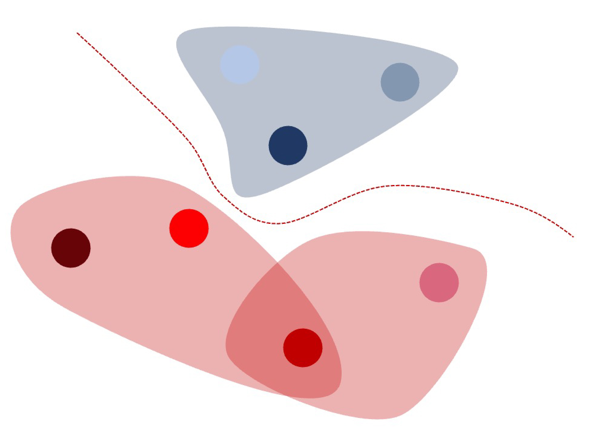
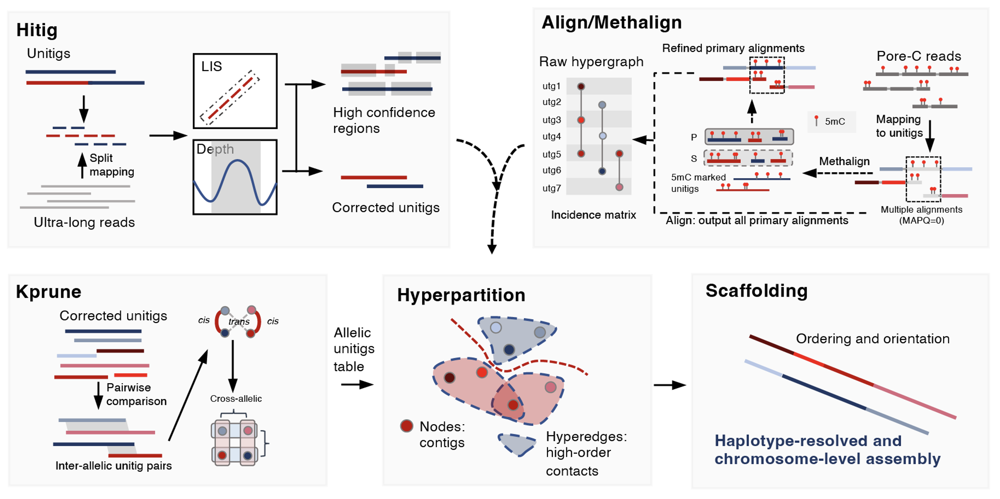

       

<h1 align="center"><b>C</b>-Phasing</h1>

 <b>Phasing</b> and scaffolding polyploid genomes based on Pore-<b>C</b>, HiFi-<b>C</b>/<b>C</b>iFi, Ultra-long, Hi-<b>C</b> or Omni-<b>C</b>  data

***  

> [!IMPORTANT]
> Documentation is hosted at [Documentation](https://wangyibin.github.io/CPhasing) | [中文文档](https://wangyibin.github.io/CPhasing/zh/latest)  
> [Installation](https://wangyibin.github.io/CPhasing/latest/installation/)| [Get Start](https://wangyibin.github.io/CPhasing/latest/basic_usage/) | [安装](https://wangyibin.github.io/CPhasing/zh/latest/installation/) | [快速开始](https://wangyibin.github.io/CPhasing/zh/latest/basic_usage/)

## Introduction
One of the major problems with Hi-C scaffolding of polyploid genomes is a large proportion of ambiguous short-read mapping, leading to a high-level of switched or chimeric assemblies. Now, the long-read-based chromosome conformation capture technology, e.g., **Pore-C**, **HiFi-C**(**CiFi**), provides an effective way to overcome this problem. Here, we developed a new pipeline, namely `C-Phasing`, which is specifically tailored for polyploid phasing by leveraging the advantage of Pore-C or HiFi-C data. It also works on **Hi-C** or **Omni-C** data and **diploid** genome assembly.  
  
The advantages of `C-Phasing`:   
- High speed.   
- High anchor rate of genome. 
- High accuracy of polyploid phasing. 

More details please check the documentation:  
[Documentation](https://wangyibin.github.io/CPhasing/) | [中文文档](https://wangyibin.github.io/CPhasing/zh)

## Example Dataset

A lightweight example dataset is available under `examples/` for verifying installation and demonstrating the basic C-Phasing workflow.

See: [Installation](https://wangyibin.github.io/CPhasing/latest/installation/#installation-verification-example-run)

## Citation
If you use C-Phasing in your work, please cite: 
- **C-Phasing**
    > Yibin Wang, Ping Zhao, Xiaofei Zeng, Jiaxin Yu, Aoqian Dong, Yi Liu, Mengwei Jiang, Fang Wang, Xiao Chen, Shengcheng Zhang, Shuai Chen, Yuqing Gong, Yixing Zhang, Ruicai Long, Maojun Wang, Haibao Tang and Xingtan Zhang. Enhanced Pore-C with C-Phasing Enables Chromosomal-Scale, Haplotype-Resolved Assembly of Ultra-Complex Genomes, 05 November 2025, PREPRINT (Version 1) available at Research Square [https://doi.org/10.21203/rs.3.rs-7343323/v1]

- And HapHiC:
    > Xiaofei Zeng, Zili Yi, Xingtan Zhang, Yuhui Du, Yu Li, Zhiqing Zhou, Sijie Chen, Huijie Zhao, Sai Yang, Yibin Wang, Guoan Chen. Chromosome-level scaffolding of haplotype-resolved assemblies using Hi-C data without reference genomes. Nature Plants, 10:1184-1200. doi: https://doi.org/10.1038/s41477-024-01755-3

- And ALLHiC
    > Xingtan Zhang, Shengcheng Zhang, Qian Zhao, Ray Ming, Haibao Tang. (2019) Assembly of allele-aware, chromosomal-scale autopolyploid genomes based on Hi-C data. Nature Plants, 5:833-845. doi: https://doi.org/10.1038/s41477-019-0487-8

## For Hi-C data
For Hi-C data, users may also consider using our alternative software, [**HapHiC** (https://github.com/zengxiaofei/HapHiC)](https://github.com/zengxiaofei/HapHiC), which is specifically designed for Hi-C data and has demonstrated strong performance across multiple projects.
